# StreamingApp — End-to-End AWS DevOps Deployment Guide

## 1. Project Overview

StreamingApp (StreamFlix) is a microservices-based video streaming application deployed on Amazon Elastic Kubernetes Service (EKS).

The project demonstrates the integration of source control, containerization, continuous integration, container registry management, Kubernetes orchestration, and Helm-based deployments.

### Project Objectives

- Maintain application source code using Git and GitHub.
- Containerize five application services using Docker.
- Automate image builds and registry pushes using Jenkins.
- Store versioned Docker images in Amazon ECR.
- Provision and manage an Amazon EKS Kubernetes cluster.
- Deploy microservices using Kubernetes and Helm.
- Expose the frontend through an AWS Load Balancer.
- Validate application availability, authentication, and service health.
- Document troubleshooting, deployment evidence, and limitations.

### Technology Stack

| Layer | Technology |
|-------|------------|
| Source Control | Git and GitHub |
| CI/CD | Jenkins Declarative Pipeline |
| Containerization | Docker |
| Container Registry | Amazon ECR |
| Cloud Provider | Amazon Web Services |
| Container Orchestration | Amazon EKS / Kubernetes |
| Deployment Management | Helm |
| Frontend | React and Nginx |
| Backend | Node.js Microservices |
| Database | MongoDB 7 |
| Networking | AWS Load Balancer, Kubernetes Services |
| Command-Line Tools | AWS CLI, kubectl, Helm |

## 2. Application Architecture

### 2.1 High-Level Deployment Flow

```text
Developer
    |
    v
GitHub Repository (main)
    |
    v
Jenkins CI/CD Pipeline
    |
    +--> Verify Source
    |
    +--> Build Five Docker Images
    |
    +--> Authenticate to Amazon ECR
    |
    +--> Push Versioned Images (1.0.3)
                  |
                  v
           Amazon ECR
                  |
                  v
        Helm Deployment Chart
                  |
                  v
         Amazon EKS Cluster
                  |
     +------------+------------+
     |            |            |
     v            v            v
 React/Nginx   Backend       MongoDB
 Frontend      Services      Database
     |
     v
 AWS Load Balancer
     |
     v
 End Users
```

The Jenkins pipeline automates image building and pushing. The final Helm upgrade to version 1.0.3 was executed manually from WSL; automated deployment from Jenkins is not yet implemented.

### 2.2 Application Components

| Component | Responsibility |
|-----------|----------------|
| Frontend | React user interface served by Nginx |
| Auth Service | User registration, authentication, and JWT handling |
| Streaming Service | Video metadata and streaming-related APIs |
| Admin Service | Administrative video management |
| Chat Service | Chat APIs and Socket.IO functionality |
| MongoDB | Application data storage |

### 2.3 Request Routing

The frontend is exposed through a Kubernetes LoadBalancer Service.

Nginx serves the React application and proxies API requests to internal Kubernetes services.

This enables the frontend to use relative API URLs rather than browser-accessible backend addresses.

## 3. AWS Infrastructure

### 3.1 AWS Account and Region

- AWS Region: `ap-south-1` (Mumbai)
- AWS CLI Profile: `streaming-app`
- EKS Cluster: `streamingapp-eks`
- Kubernetes Namespace: `streamingapp`

AWS account identifiers and access credentials should not be published in screenshots or documentation.

### 3.2 Configure AWS CLI

Verify that the intended AWS profile is configured:

```bash
export AWS_PROFILE=streaming-app

aws sts get-caller-identity
aws configure get region --profile streaming-app
```

The CLI identity must have appropriate permissions to access ECR and EKS.

### 3.3 Amazon EKS Cluster

The project uses an Amazon EKS cluster named `streamingapp-eks` with a managed worker node group.

The final verified environment contained:

- Two Kubernetes worker nodes in Ready state
- Kubernetes version 1.34
- Six application/database pods in Running state
- A public frontend LoadBalancer Service

Verify the cluster:

```bash
aws eks describe-cluster \
  --name streamingapp-eks \
  --region ap-south-1 \
  --query 'cluster.status' \
  --output text
```

Configure kubectl:

```bash
aws eks update-kubeconfig \
  --region ap-south-1 \
  --name streamingapp-eks \
  --profile streaming-app
```

Verify worker nodes:

```bash
kubectl get nodes -o wide
```

### Screenshot Evidence

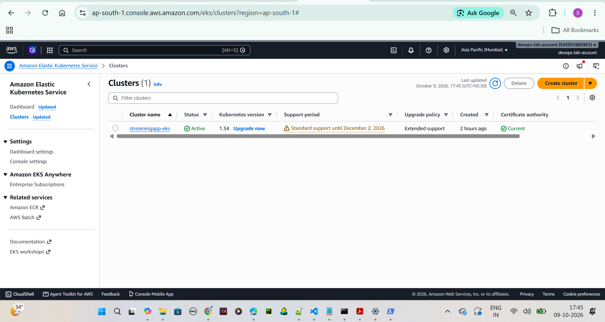

*Figure 1: Amazon EKS cluster details.*

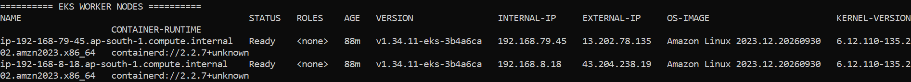

*Figure 2: Two Ready Kubernetes worker nodes.*

## 4. Docker Containerization

Five application components are packaged into Docker images:

1. Authentication service
2. Streaming service
3. Admin service
4. Chat service
5. React frontend

The frontend image uses Nginx to serve the production React build and route requests to backend services.

### 4.1 Docker Build Contexts

The project uses the following Docker build commands:

```bash
docker build -t streaming-auth:1.0.3 ./backend/authService

docker build \
  -f ./backend/streamingService/Dockerfile \
  -t streaming-stream:1.0.3 ./backend

docker build \
  -f ./backend/adminService/Dockerfile \
  -t streaming-admin:1.0.3 ./backend

docker build \
  -f ./backend/chatService/Dockerfile \
  -t streaming-chat:1.0.3 ./backend
```

The frontend Docker build uses environment-specific API build arguments defined in the Jenkinsfile.

The actual frontend build and push were verified through Jenkins Build #8.

### 4.2 Container Image Versioning

The final release uses image tag `1.0.3` for all five application services.

Using a consistent version tag simplifies deployment tracking and troubleshooting.

## 5. Amazon ECR

Amazon Elastic Container Registry stores the application's Docker images.

### 5.1 ECR Repositories

| Repository | Verified Image Tag |
|------------|--------------------|
| streaming-auth | 1.0.3 |
| streaming-stream | 1.0.3 |
| streaming-admin | 1.0.3 |
| streaming-chat | 1.0.3 |
| streaming-frontend | 1.0.3 |

### 5.2 Verify ECR Images

```bash
export AWS_PROFILE=streaming-app

for service in auth stream admin chat frontend; do
  echo "===== streaming-${service} ====="

  aws ecr describe-images \
    --region ap-south-1 \
    --repository-name "streaming-${service}" \
    --image-ids imageTag=1.0.3 \
    --query 'imageDetails[0].imageTags' \
    --output text
done
```

All five repositories were verified to contain the `1.0.3` tag.

### Screenshot Evidence

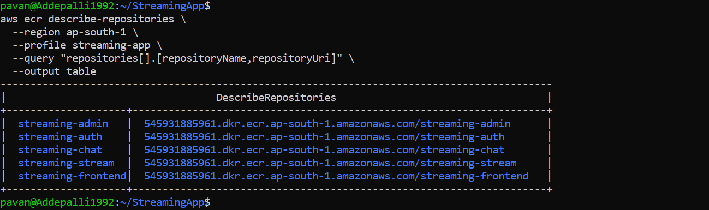

*Figure 3: Amazon ECR repositories.*

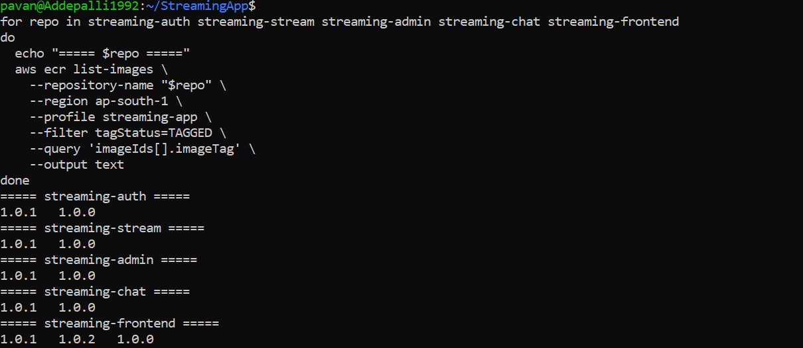

*Figure 4: Docker images tagged 1.0.3.*


## 6. Jenkins CI/CD Pipeline

### 6.1 Purpose

Jenkins automates the continuous integration and container image publishing process.

The pipeline retrieves application source code from GitHub, verifies the build environment, builds five Docker images, and pushes them to Amazon ECR.

The pipeline is implemented using a Declarative Jenkinsfile stored at the root of the GitHub repository.

### 6.2 Pipeline Configuration

| Setting | Value |
|---------|-------|
| Pipeline Name | StreamingApp-Srinivas-CI-CD |
| Source Repository | https://github.com/srinivassriaddepalli-creator/StreamingApp |
| Branch | main |
| Pipeline Definition | Jenkinsfile |
| AWS Region | ap-south-1 |
| Container Registry | Amazon ECR |
| Final Image Tag | 1.0.3 |
| Verified Build | Build #8 |
| Build Result | SUCCESS |

Jenkins URL:

https://jenkinsacademics.herovired.com/job/StreamingApp-Srinivas-CI-CD/

### 6.3 Pipeline Stages

#### Stage 1: Checkout SCM

Jenkins retrieves the source code from the configured GitHub repository.

This stage ensures that the pipeline uses the repository contents associated with the selected build revision.

#### Stage 2: Verify Source

The pipeline runs:

```bash
git rev-parse --short HEAD
docker --version
aws --version
```

These commands confirm the checked-out Git revision and availability of Docker and AWS CLI.

#### Stage 3: Build Docker Images

Jenkins builds the authentication, streaming, admin, chat, and frontend images.

The frontend build uses relative API endpoints so browser requests can be routed through Nginx inside Kubernetes.

The final frontend build arguments include:

```bash
--build-arg REACT_APP_AUTH_API_URL=/api
--build-arg REACT_APP_STREAMING_API_URL=/api
--build-arg REACT_APP_STREAMING_PUBLIC_URL=
--build-arg REACT_APP_ADMIN_API_URL=/api/admin
--build-arg REACT_APP_CHAT_API_URL=/api/chat
--build-arg REACT_APP_CHAT_SOCKET_URL=
```

The frontend image is tagged `streaming-frontend:1.0.3`.

#### Stage 4: Push Images to Amazon ECR

Jenkins uses an AWS credential stored in Jenkins Credentials.

The pipeline authenticates to ECR using:

```bash
aws ecr get-login-password --region ap-south-1 \
  | docker login --username AWS --password-stdin \
    <account-id>.dkr.ecr.ap-south-1.amazonaws.com
```

The actual Jenkinsfile obtains the registry address from its configured environment variable.

For each service, Jenkins tags the local Docker image with its ECR repository URI and pushes it to the registry.

AWS access keys are not stored in the GitHub repository.

#### Stage 5: Post Actions

Jenkins displays a success or failure message based on the pipeline result.

The Console Output and Stage View can be used to identify failures.

### 6.4 Final Build Verification

Jenkins Build #8 completed successfully.

The verified pipeline included:

- Checkout SCM: SUCCESS
- Verify Source: SUCCESS
- Build Docker Images: SUCCESS
- Push Images to ECR: SUCCESS
- Post Actions: SUCCESS

All five Docker image repositories were subsequently checked through AWS CLI and confirmed to contain version `1.0.3`.

### 6.5 CI/CD Scope and Limitations

The Jenkins pipeline automates Docker image creation and publishing to ECR.

The Kubernetes deployment is currently performed separately using Helm commands from WSL.

Therefore, the project demonstrates automated CI and image delivery, with manual deployment to EKS.

Automated Helm deployment, automated tests, vulnerability scanning, and approval gates are potential future improvements.

### Screenshot Evidence

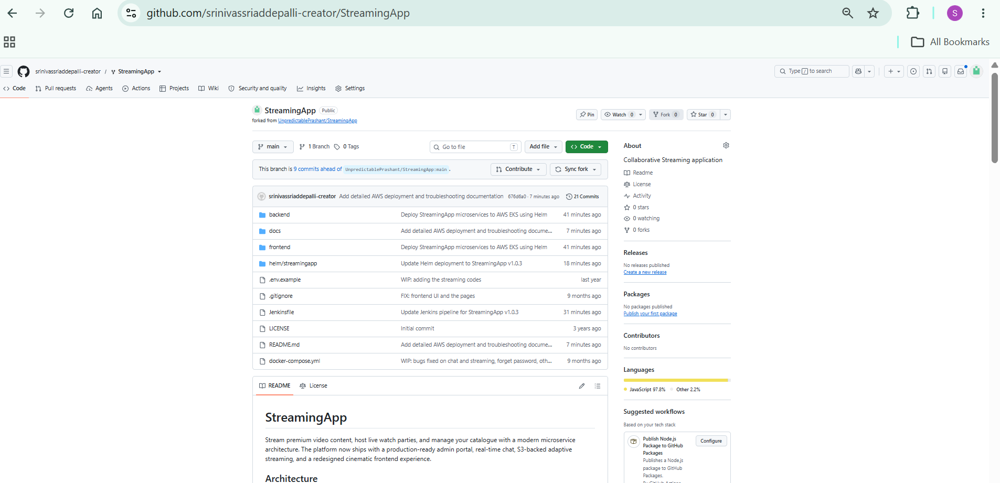

*Figure 5: GitHub repository containing the Jenkinsfile and Helm chart.*

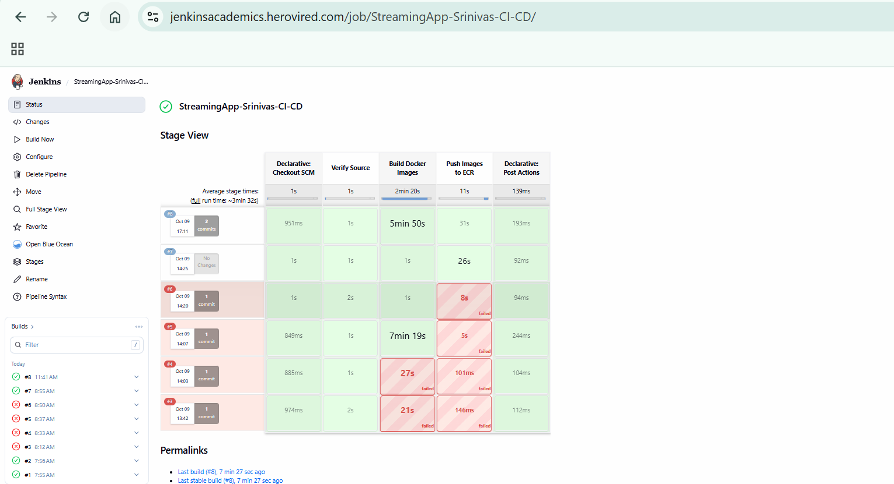

*Figure 6: Jenkins Build #8 showing all pipeline stages completed successfully.*


## 7. Kubernetes Deployment Architecture

### 7.1 Cluster and Namespace

The application runs on Amazon EKS in the `streamingapp` namespace.

The verified deployment uses two Ready worker nodes and six pods:

| Workload | Purpose |
|----------|---------|
| streaming-auth | Authentication APIs |
| streaming-stream | Streaming APIs |
| streaming-admin | Administrative APIs |
| streaming-chat | Chat APIs and WebSocket support |
| streaming-frontend | React frontend and Nginx reverse proxy |
| streaming-mongodb | MongoDB database |

The namespace provides logical isolation for the application's Kubernetes resources.

### 7.2 Kubernetes Deployments

The Helm chart creates Deployments for the five application services and MongoDB.

Deployments manage pod creation, desired replica counts, and rolling updates.

During the final Helm upgrade, Kubernetes replaced the application pods with images tagged `1.0.3`.

MongoDB remained running during the upgrade.

### 7.3 Kubernetes Services

Backend services use internal Kubernetes networking.

The frontend uses a LoadBalancer Service to provide public access.

The architecture separates externally accessible traffic from internal microservice communication.

Inspect services:

```bash
kubectl get services -n streamingapp
```

Inspect deployments:

```bash
kubectl get deployments -n streamingapp
```

### 7.4 MongoDB

MongoDB 7 is deployed inside Kubernetes.

Application services connect to MongoDB through the internal service address:

```text
streaming-mongodb:27017
```

The current MongoDB configuration uses ephemeral `emptyDir` storage.

**Important:** Data can be lost when the MongoDB pod is replaced or rescheduled. A PersistentVolumeClaim and suitable storage class should be configured before production use.

### 7.5 Application Secrets

The application uses a Kubernetes Secret named:

```text
streamingapp-secrets
```

The secret supplies the `JWT_SECRET` environment variable to backend services.

Create the secret without storing its value in source control:

```bash
kubectl create namespace streamingapp \
  --dry-run=client -o yaml | kubectl apply -f -

read -rsp "Enter JWT secret: " JWT_VALUE
echo

kubectl create secret generic streamingapp-secrets \
  --namespace streamingapp \
  --from-literal=JWT_SECRET="$JWT_VALUE"

unset JWT_VALUE
```

For an existing deployment, do not recreate the secret unnecessarily. Rotating a JWT secret can invalidate existing authentication tokens.

### 7.6 Frontend Nginx Reverse Proxy

The frontend container serves the React production build using Nginx.

Nginx also forwards API requests to internal Kubernetes services.

This design allows browser requests to use the public frontend origin while backend traffic stays inside the cluster.

The Nginx configuration is stored at:

```text
frontend/nginx.conf
```

The frontend uses relative API URLs, including `/api`, `/api/admin`, and `/api/chat`.

The streaming and chat services also have their own internal routes.

### 7.7 Cross-Origin Resource Sharing (CORS)

An earlier deployment experienced browser requests being rejected because backend services did not allow the actual frontend origin.

The backend configuration was updated to allow the public LoadBalancer origin.

The permanent configuration is stored in the Helm chart rather than relying only on temporary `kubectl set env` changes.

This fix enabled successful registration and login through the public application URL.

## 8. Helm Deployment

### 8.1 Helm Chart Structure

The Helm chart is stored at:

```text
helm/streamingapp/
```

Important files include:

| File | Purpose |
|------|---------|
| Chart.yaml | Helm chart metadata |
| values.yaml | Container image versions and deployment settings |
| templates/services.yaml | Application Deployments and Services |
| templates/mongodb.yaml | MongoDB Deployment and Service |

### 8.2 Validate the Helm Chart

Run:

```bash
helm lint ./helm/streamingapp
```

The final validation completed with:

```text
1 chart(s) linted, 0 chart(s) failed
```

Helm also displayed a nonblocking recommendation to add an icon to `Chart.yaml`.

### 8.3 Deploy the Application

Configure the AWS profile:

```bash
export AWS_PROFILE=streaming-app
```

Connect kubectl to the cluster:

```bash
aws eks update-kubeconfig \
  --region ap-south-1 \
  --name streamingapp-eks
```

Deploy the Helm release:

```bash
helm upgrade --install streamingapp ./helm/streamingapp \
  --namespace streamingapp \
  --wait \
  --timeout 10m
```

The final successful upgrade deployed application images tagged `1.0.3`.

### 8.4 Verify Helm Release

```bash
helm list -n streamingapp
helm status streamingapp -n streamingapp
```

The verified release had:

| Property | Value |
|----------|-------|
| Release | streamingapp |
| Namespace | streamingapp |
| Revision | 3 |
| Status | deployed |
| Chart | streamingapp-1.0.0 |
| Application images | 1.0.3 |

The Helm chart's `appVersion` metadata was subsequently updated to `1.0.3` and committed to GitHub. The revision 3 release was created before that metadata-only update.

### 8.5 Verify Kubernetes Pods

```bash
kubectl get pods -n streamingapp
```

The final verification showed:

- Six pods in Running state
- All pods Ready (1/1)
- Zero container restarts

### 8.6 Verify Container Image Versions

```bash
kubectl get deployments -n streamingapp \
  -o custom-columns='DEPLOYMENT:.metadata.name,IMAGES:.spec.template.spec.containers[*].image'
```

This command helps confirm the image versions actually referenced by the Kubernetes Deployments.

### 8.7 Rollback Procedure

If a future Helm upgrade fails, inspect the release history:

```bash
helm history streamingapp -n streamingapp
```

To roll back to the previously working revision:

```bash
helm rollback streamingapp 2 -n streamingapp --wait
```

This is an example recovery procedure. No rollback was required for the successful version 1.0.3 deployment.

### Screenshot Evidence

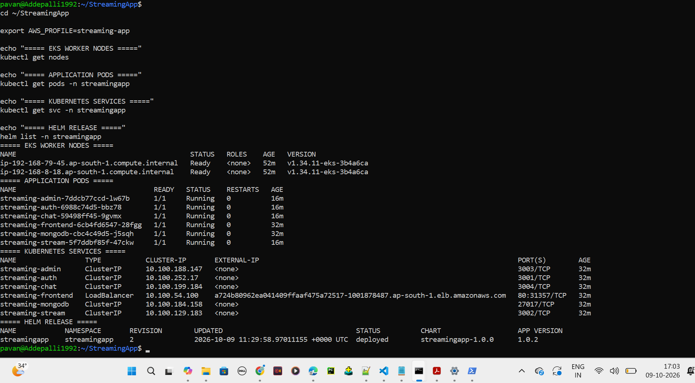

*Figure 7: Six Kubernetes pods in Running state.*

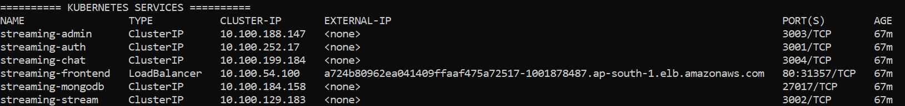

*Figure 8: Internal services and the public frontend LoadBalancer.*

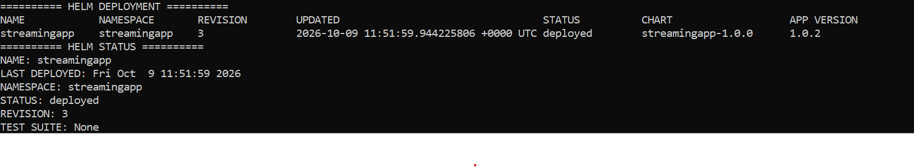

*Figure 9: Helm release deployed successfully.*


## 9. Application Testing and Verification

### 9.1 Public Application Access

The frontend is accessible through the AWS LoadBalancer Service.

Deployment URL:

http://a724b80962ea041409ffaaf475a72517-1001878487.ap-south-1.elb.amazonaws.com/

The URL is generated by AWS and may change if the LoadBalancer is recreated.

### 9.2 Frontend Verification

The following browser checks were completed:

1. Opened the public application URL.
2. Confirmed the StreamFlix frontend loaded.
3. Registered a new user account.
4. Logged in successfully.
5. Navigated to the authenticated `/browse` page.
6. Repeated the browser check after upgrading the deployment to image version 1.0.3.

The final screenshot showed the Browse page with navigation controls and a signed-in user profile.

### 9.3 Backend Health Checks

The backend services expose health endpoints.

| Service | Endpoint |
|---------|----------|
| Auth | `/health` |
| Streaming | `/api/health` |
| Admin | `/api/health` |
| Chat | `/api/health` |

All four backend health endpoints returned HTTP 200 during deployment testing.

### 9.4 Kubernetes Verification

Check the deployment status:

```bash
kubectl get deployments -n streamingapp
kubectl get pods -n streamingapp
kubectl get services -n streamingapp
```

Check rollout completion:

```bash
kubectl rollout status deployment/streaming-auth -n streamingapp
kubectl rollout status deployment/streaming-stream -n streamingapp
kubectl rollout status deployment/streaming-admin -n streamingapp
kubectl rollout status deployment/streaming-chat -n streamingapp
kubectl rollout status deployment/streaming-frontend -n streamingapp
```

### 9.5 Application Logs

Inspect recent application logs:

```bash
kubectl logs deployment/streaming-auth -n streamingapp --tail=100
kubectl logs deployment/streaming-stream -n streamingapp --tail=100
kubectl logs deployment/streaming-admin -n streamingapp --tail=100
kubectl logs deployment/streaming-chat -n streamingapp --tail=100
kubectl logs deployment/streaming-frontend -n streamingapp --tail=100
```

These commands read Kubernetes pod logs. They do not, by themselves, establish a centralized logging solution.

### 9.6 Testing Scope

The following checks were verified:

| Test | Result |
|------|--------|
| Jenkins Build #8 | Passed |
| Five ECR image tags | Verified |
| Helm lint | Passed |
| Helm upgrade | Passed |
| Kubernetes pod readiness | Passed |
| Backend health endpoints | HTTP 200 |
| Public frontend access | Passed |
| User registration | Passed |
| User login | Passed |
| Authenticated Browse page | Passed |

Video playback, S3-backed uploads, end-to-end chat functionality, and automated test suites have not been fully verified as part of this deployment evidence.

### Screenshot Evidence

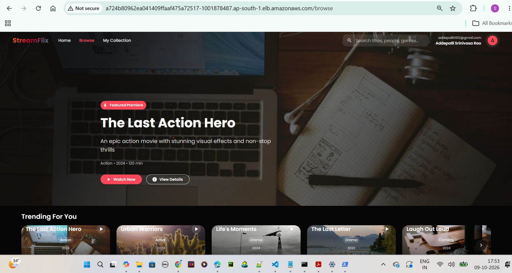

*Figure 10: StreamFlix homepage accessible through the AWS LoadBalancer.*

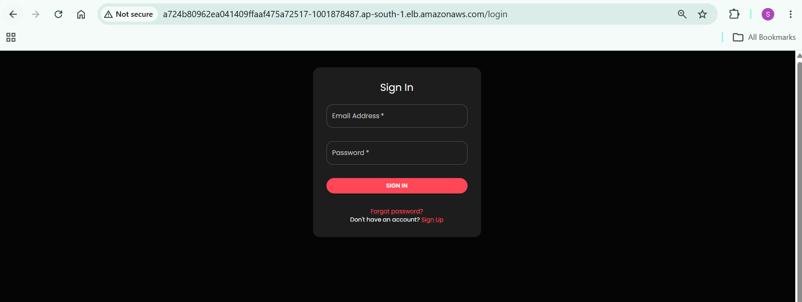

*Figure 11: Authentication testing through the public application.*


*Figure 12: Authenticated Browse page after the version 1.0.3 deployment.*

## 10. Monitoring, Logging, and Scaling

### 10.1 Current Verification Status

| Capability | Current Status |
|------------|----------------|
| Kubernetes pod status | Verified |
| Kubernetes application logs | Available through kubectl |
| Centralized logging | Not yet verified |
| Metrics monitoring dashboard | Not yet verified |
| Horizontal Pod Autoscaling | Not yet verified |
| Load or scaling tests | Not yet verified |

### 10.2 Recommended Monitoring

A production deployment should collect cluster and application metrics.

Possible tools include Prometheus, Grafana, Amazon CloudWatch, and Amazon Managed Service for Prometheus.

Metrics to monitor include CPU usage, memory usage, pod availability, request latency, and error rates.

### 10.3 Recommended Centralized Logging

A centralized logging implementation could use Fluent Bit to collect container logs and forward them to Amazon CloudWatch Logs or another log storage platform.

Centralized logs help correlate events across services and retain logs after individual pods are replaced.

### 10.4 Recommended Scaling Validation

Horizontal Pod Autoscaling can scale application replicas based on CPU or other configured metrics.

Before validating scaling, the cluster needs an appropriate metrics pipeline and application resource requests.

Example inspection commands:

```bash
kubectl get hpa -n streamingapp
kubectl top pods -n streamingapp
kubectl top nodes
```

These commands are for inspection; they do not configure autoscaling.

### Screenshot Placeholders

Monitoring, centralized logging, and scaling screenshots should be added only after these features have been implemented and verified.

## 11. Operational Limitations and Security

- The application is currently exposed over HTTP, not HTTPS.
- MongoDB uses ephemeral storage.
- Jenkins automates builds and ECR publishing but not Helm deployment.
- Automated tests are not integrated into Jenkins.
- Monitoring dashboards and centralized logging have not yet been verified.
- Secrets must remain outside GitHub and should be managed through an approved secrets-management process.
- Temporary elevated IAM permissions used during provisioning should be removed after the project is completed.
- AWS EKS, EC2, ECR, and LoadBalancer resources may incur charges while running.

## 12. Project References

GitHub repository:

https://github.com/srinivassriaddepalli-creator/StreamingApp

Jenkins pipeline:

https://jenkinsacademics.herovired.com/job/StreamingApp-Srinivas-CI-CD/

Troubleshooting documentation:

[Troubleshooting Guide](TROUBLESHOOTING.md)

Screenshot checklist:

[Screenshot Evidence](screenshots/README.md)

